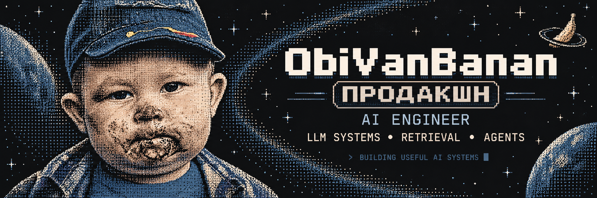

# 👾 ObiVanBanan

**AI Engineer** building production-oriented LLM systems.

`LLM Systems` • `RAG` • `Retrieval` • `Agents` • `Evals` • `Local LLMs`

> research → prototype → eval → break it → fix it → production

---

## About

I build AI systems that are not just demos, but things that can actually be measured, tested and shipped.

Currently interested in:
- autonomous coding & research harnesses
- hybrid retrieval and reranking
- evaluation-driven AI development
- local LLM inference
- production AI architecture

`ObiVanBanan Production™` — questionable ideas, measurable experiments, occasionally production.

  

